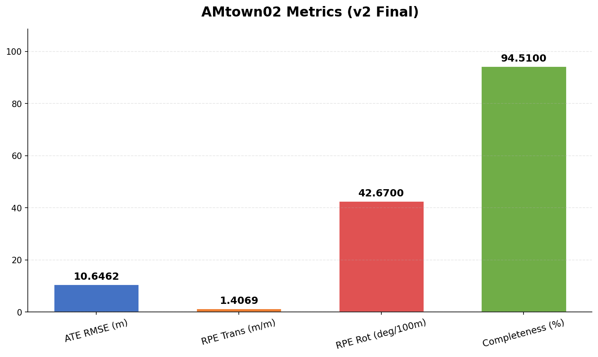
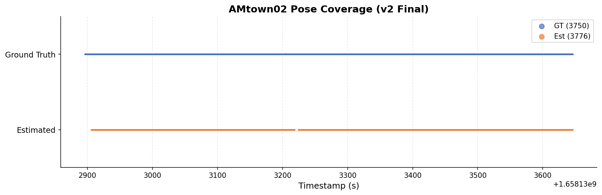
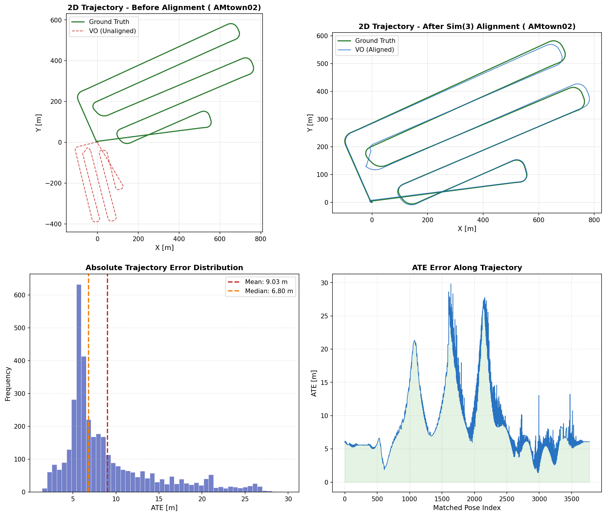

# AAE5303 Assignment 2: Groupwork Part 1 (ORB-SLAM3 VO)

## Executive Summary

This repository packages the **Part 1 VO result** on AMtown02 in assignment-style format, including:

- final leaderboard metrics
- parameter configuration and optimization notes
- visualization figures used for report presentation
- full optimization history (v1–v4) for reproducibility

## Key Results (AMtown02 — v2 Final Submission)

| Metric | Value | Description |
|--------|-------|-------------|
| **ATE RMSE** | **10.6462 m** | Global error after Sim(3) + scale correction |
| **RPE Trans Drift** | **1.4069 m/m** | Translation drift rate (delta=10 m) |
| **RPE Rot Drift** | **42.67 deg/100m** | Rotation drift rate (delta=10 m) |
| **Completeness** | **94.51%** | Matched poses / GT poses |

Result files:

- `output/PART1_AMtown02_results.md`
- `output/evaluation_report.json`
- `leaderboard/GOGOGO_Leaderboard.json`

## Implementation Parameters

Main config file:

- `configs/AMtown02_Mono_v2.yaml`

### Camera Parameters

| Parameter | Value |
|-----------|-------|
| `Camera.type` | `PinHole` |
| `Camera1.fx` | `1444.43` |
| `Camera1.fy` | `1444.34` |
| `Camera1.cx` | `1179.50` |
| `Camera1.cy` | `1044.90` |
| `Camera.width` | `2448` |
| `Camera.height` | `2048` |
| `Camera.fps` | `10` |
| `Camera.RGB` | `0` (BGR) |

### ORB Extractor Parameters

| Parameter | Value |
|-----------|-------|
| `ORBextractor.nFeatures` | `5000` |
| `ORBextractor.scaleFactor` | `1.2` |
| `ORBextractor.nLevels` | `12` |
| `ORBextractor.iniThFAST` | `8` |
| `ORBextractor.minThFAST` | `3` |

### Additional Settings

| Setting | Value |
|---------|-------|
| **CLAHE** | Enabled (clipLimit=3.0, gridSize=8×8) |
| **Playback Rate** | 0.75x |
| **Viewer** | Disabled (headless) |

### Parameter Change Note

Compared with the Docker image defaults (`nFeatures=1500, iniThFAST=20, minThFAST=7`), the v2 configuration aggressively increases feature count and lowers detection thresholds. Combined with CLAHE image preprocessing and 0.75x playback rate, this delivers the best ATE among all tested versions.

For full optimization rationale across all versions:

- `docs/PARAMETER_OPTIMIZATION.md`
- `docs/EXPERIMENT_LOG.md`

## Visualizations

### A) Leaderboard Metrics Card



### B) Pose Coverage (Timestamp Domain)



### C) Trajectory Geometry (Qualitative)



## Optimization History

Four versions were tested to converge on the optimal configuration:

| Version | ATE RMSE (m) | RPE Trans (m/m) | RPE Rot (deg/100m) | Completeness (%) | Key Changes |
|---------|-------------|-----------------|---------------------|-------------------|-------------|
| Baseline | 88.228 | 2.041 | 76.70 | 95.73 | Default params |
| **v1** | 17.155 | 1.362 | 41.82 | 90.05 | BGR fix, CLAHE, 3000 feat, 1.0x |
| **v2** ★ | **10.646** | 1.407 | 42.67 | 94.51 | 5000 feat, FAST 8/3, 0.75x |
| **v3** | 15.769 | **1.354** | **41.08** | **98.08** | 4000 feat, FAST 10/3, 0.5x |
| **v4** | 14.932 | 1.384 | **38.47** | **98.61** | v2 config + 0.5x rate |

★ **v2 selected as final submission** — best ATE RMSE (50% weight) with competitive Completeness.

Full optimization log: `docs/EXPERIMENT_LOG.md`

## Part 1 to Part 2 Handoff

This repository is Part 1 only, but its output is directly used by Part 2:

- Part 1 provides camera poses (`CameraTrajectory.txt`)
- Part 2 (OpenSplat) consumes poses + images to reconstruct 3D scene

That is the core technical linkage between assignment sections.

## Reproducibility

### Prerequisites
- Docker Desktop installed
- Dataset file `AMtown02.bag` (16.5 GB) placed at `D:\AMtown02.bag`
- Docker image: `liangyu99/orbslam3_ros1:latest`

### Step 1: Start Docker Container
```bash
docker pull liangyu99/orbslam3_ros1:latest
docker run -it --name AMtown02_Run -v D:\:/data liangyu99/orbslam3_ros1:latest bash
```

### Step 2: Apply Code Patches (Inside Container)
```bash
cd /root/ORB_SLAM3

# Copy config file
cp /data/liangyun99/Hand_off/configs/AMtown02_Mono_v2.yaml Examples/Monocular/

# Copy modified source files
cp /data/liangyun99/Hand_off/src/ros_mono_compressed.cc \
   Examples_old/ROS/ORB_SLAM3/src/ros_mono_compressed.cc

# Apply System.cc patch (bypass monocular SaveTrajectoryTUM restriction)
# Line 572: change "if(mSensor==MONOCULAR)" to "if(false && mSensor==MONOCULAR)"
sed -i 's/if(mSensor==MONOCULAR)/if(false \&\& mSensor==MONOCULAR)/' src/System.cc
```

### Step 3: Rebuild ORB-SLAM3
```bash
source /opt/ros/noetic/setup.bash
export ROS_PACKAGE_PATH=/opt/ros/noetic/share:/root/ORB_SLAM3/Examples_old/ROS:$ROS_PACKAGE_PATH

# Rebuild core library
cd /root/ORB_SLAM3/build
cmake .. -DCMAKE_BUILD_TYPE=Release
make -j$(nproc)

# Rebuild ROS nodes
cd /root/ORB_SLAM3/Examples_old/ROS/ORB_SLAM3/build
cmake .. -DROS_BUILD_TYPE=Release
make -j$(nproc)
```

### Step 4: Run the Experiment
```bash
cd /root/ORB_SLAM3

# Start roscore
roscore &
sleep 3

# Run ORB-SLAM3 Mono with CLAHE enabled (3rd arg = "true")
./Examples_old/ROS/ORB_SLAM3/Mono_Compressed \
    Vocabulary/ORBvoc.txt \
    Examples/Monocular/AMtown02_Mono_v2.yaml true &
sleep 15

# Play bag at 0.75x rate
rosbag play /data/AMtown02.bag \
    /left_camera/image/compressed:=/camera/image_raw/compressed --rate 0.75

# After playback completes, send SIGINT to SLAM to trigger trajectory save
kill -2 $(pgrep -f Mono_Compressed)
sleep 10
```

### Step 5: Evaluate Results
```bash
# Extract ground truth (only needed once)
python3 /data/liangyun99/Hand_off/scripts/extract_ground_truth.py

# Run evaluation
bash /data/liangyun99/Hand_off/scripts/evaluate.sh
```

Full automation script: `scripts/run_experiment.sh`

### Quick Verification (Without Re-running)
The `output/trajectories/` directory contains the actual v2 output files:
- `CameraTrajectory.txt` — full-frame estimated trajectory (TUM format)
- `KeyFrameTrajectory.txt` — keyframe trajectory
- `ground_truth.txt` — extracted RTK ground truth (TUM format)

These can be directly evaluated with `evo`:
```bash
evo_ape tum ground_truth.txt CameraTrajectory.txt --align --correct_scale --t_max_diff 0.1
```

## Repository Structure

```
AAE5303_Group_Project_VO/
├── README.md                            # This file
├── .gitignore
├── configs/
│   └── AMtown02_Mono_v2.yaml            # Final submission config (v2)
├── docs/
│   ├── PARAMETER_OPTIMIZATION.md        # Optimization rationale
│   └── EXPERIMENT_LOG.md                # Full v1–v4 experiment log
├── figures/
│   ├── amtown02_metrics.png             # Metrics bar chart
│   ├── amtown02_pose_coverage.png       # Pose coverage plot
│   └── trajectory_evaluation.png        # 4-panel trajectory evaluation
├── leaderboard/
│   └── GOGOGO_Leaderboard.json           # Leaderboard submission JSON
├── output/
│   ├── PART1_AMtown02_results.md        # Structured results document
│   ├── evaluation_report.json           # Machine-readable evaluation
│   └── trajectories/
│       ├── CameraTrajectory.txt         # v2 full-frame trajectory output
│       ├── KeyFrameTrajectory.txt       # v2 keyframe trajectory output
│       └── ground_truth.txt             # RTK ground truth (TUM format)
├── scripts/
│   ├── run_experiment.sh                # Full automation script
│   ├── evaluate.sh                      # Evaluation commands
│   └── extract_ground_truth.py          # GT extraction from bag
└── src/
    ├── ros_mono_compressed.cc           # Modified ROS node (CLAHE + TUM save)
    ├── CMakeLists.txt                   # ROS package CMakeLists
    └── System.cc.patch                  # Patch for monocular TUM save
```
